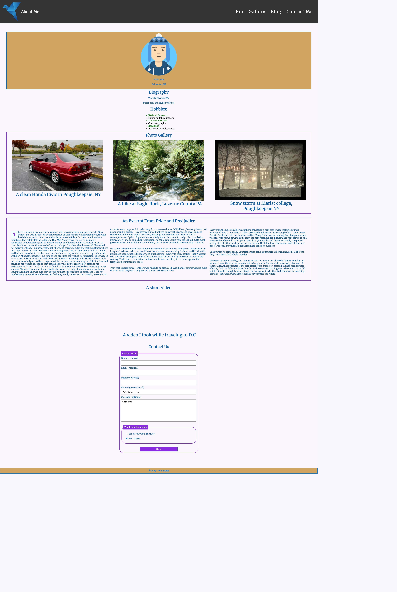

# README

Will Sisler - about me

My name is Will Sisler and this is my About Me website’s README section. Throughout the semester I’ve built upon the site, adding new selections and features as I learned them. The skills I implemented span from cascading style sheet, to box models, creating responsive design to embedding media, and adding navigation; just to name a few. The style.css section of my page is what I am most proud of. Learning how to correctly use flex grids and box models was one of the hardest parts of the class. The results of my effort can be seen in my beautiful, very responsive site. The purpose of the site is to say hello to the world, and introduce it to me and my hobbies. Sort of like a blog, except the only topic discussed is me. I decided to use a color scheme which includes various shades of purple, blue, black and white. For my sites background I used #faf8ff, which is an almost-white shade of purple. The majority of the text within my site is a dark-ish blue color, #0E5EA9, and I used the color #8a2be2 for my section borders. As I continue to build my site I plan on adjusting my color scheme to ensure it achieves a score of 4.5 or high for colorblind accessibility. All the content within the site is my own, and I plan on keeping it that way. 

After following several steps in the About Me Final Project module, I have concluded that my color scheme is awesome and needs no changing at all. I added a picture of myself to replace my hero avatar, along with adding hyperlinks to my repository and instagram. I included a lengthy bioagraphy paragraph and extended the hobby list aswell. I also changed up some of the aestetics of the page in the form of new borders and formatting.  

©2023 - Will Sisler

